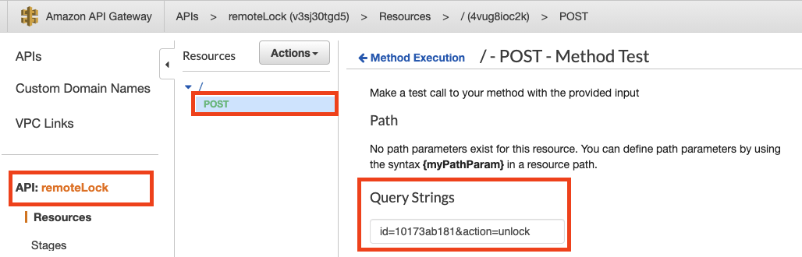

# EventBridge integration with AWS Lambda Functions - TypeScript

This is an example SAM Application showing how to use EventBridge as a communication mechanism between AWS Lambda Functions using TypeScript.

We will use a Remote Lock scenario where you may have a client app (not included in this example) that allows you to lock and unlock your door lock using AWS cloud native technologies. We will just focus on setting up API Gateway, Lambda Functions and Event Bridge as detailed below.


> TypeScript is a Javascript based framework and not a runtime. Due to this fact it is not supported officially on Lambda Functions so there are some changes that need to be made in the SAM basic project to convert a nodejs project to support TypeScript.

> If you want more details on that please go to [this](https://github.com/vincedgy/aws-sam-webpack-typescript) project.

## Requirements

* Visual Studio Code
* AWS Toolkit to Visual Studio Code
* SAM CLI

## Steps to run 

#### 1. Clone the project

```bash
$ mkdir projects && cd projects
$ git clone https://github.com/t1agob/eventbridge-ts.git eventbridge-ts
```

#### 2. Open Visual Studio Code from root folder

```bash
$ cd eventbridge-ts
$ code .
```

#### 3. Install the necessary NPM packages

```bash
npm install
```

#### 4. Use webpack to package the source code before publishing SAM Application to AWS

```bash
NODE_ENV=development npm run-script build
```

#### 5. Validate that publishing folder was created


#### 6. Publish SAM Application using AWS Toolkit

From the command palette select **AWS: Deploy SAM Application**.


Provide the SAM template file from the .aws-sam folder. 


Select the region where you want to deploy the environment.


Select the S3 bucket where you want to deploy the generated artifacts.


Give a name to the CloudFormation deployment generated by SAM.


Press Enter! This should take a minute or so. Once complete you should see something like the below.


#### 7. Test the scenario

Open your AWS Console and navigate to API Gateway service. From there you will see your newly published API.



Test the POST method by passing the _action_ and _id_ as query string parameters. 

```html
id=10173ab181&action=unlock
```

You can provide any id of your choice (this represents the lock id) and the supported actions are _lock_ and _unlock_.

#### 8. Validate that the scenario is working

In order to validate the scenario is working end to end, let's check the cloudwatch logs on the consumer lambda function.

You should see something similar to this. The output will depend on the parameters you specified on the previous step.


### Contributions are welcome!

If you feel that there is space for improvement in this project or if you find a bug please raise an issue or submit a PR.
